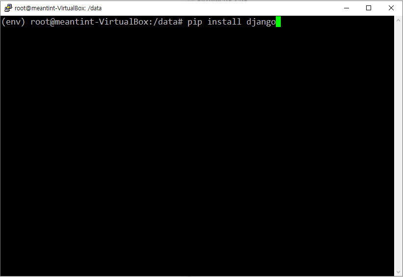
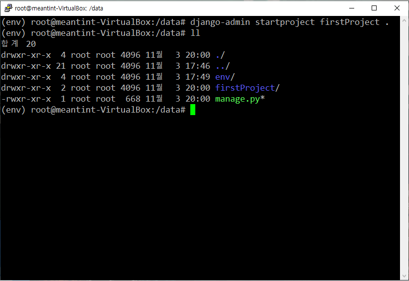

## putty 원격 접속을 위한 설정하기

<kbd></kbd>

- VituralBox의 `환경설정 -> 네트워크`에서 `NAT1`을 더블 클릭하면 아래와 같은 화면이 나온다.

<kbd></kbd>

- 화면에서 포트 포워딩을 누르면 아래와 같은 화면이 나온다.

- 이곳의 호스트 IP는 내가 생성한 호스트 IP를 사용한 것이다.

<kbd></kbd>

<kbd></kbd>

- 이제 `putty`로 호스트 ip의 주소와, port번호를 입력하면 로그인을 하라는 창이 나오고 비밀번호까지 입력하게 되면 

<kbd></kbd>

<kbd></kbd>

- 내가 만든 가상 환경을 `putty`로 사용할 수 있게 되었다.

<kbd></kbd>

## django 사용하기

- `python3-dev`와 `python3-pip`를 설치해준다.

> pip는 파이썬으로 작성된 패키지 라이브러리들을 관리해주는 시스템이다.

<kbd></kbd>

<kbd></kbd>

- `pip install --upgrade pip`로 `pip`를 최신 버전으로 업그레이드 해준다.

<kbd></kbd>

- `virtualenv`를 설치한다.

> virtualenv는 분리된 파이썬 환경을 만들어주는 도구이다. 가상 환경을 만듬으로써 환경이 분리되고 이로 인해 여러개의 파이썬 프로젝트가 충돌이 일어나지 않게 된다.

<kbd></kbd>

- `data` 폴더를 만든다.

<kbd></kbd>

- `virtualenv env` 명령어를 통해 `env`라는 이름의 가상 환경을 만들어준다.

<kbd></kbd>

- `source env/bin/activate` 명령어를 통해 가상 환경 `env`를 시작시킨다.

> 현재의 가상 환경을 종료하고 싶다면 deactivate 명령어를 사용하면 된다.

<kbd></kbd>

- `pip list`를 통해 현재의 가상 환경에 설치 되어있는 모듈을 확인할 수 있다.

- `pip --version`을 통해 현재 `pip`의 버전을 확인할 수 있다.

<kbd></kbd>

<kbd></kbd>

- `pip install django` 명령어를 통해 `django`를 설치한다.

<kbd></kbd>

- `django-admin startproject firstProject .` 명령어를 통해 `firstProject`라는 이름의 프로젝트를 현재 폴더에 생성하였다.

- `ll` 명령어를 통해 `data` 폴더에 `firstProject`와 `manage.py`가 있는 것을 확인 할 수 있다.

<kbd></kbd>

- `./manage.py runserver 0.0.0.0:80`을 통해 웹 서버를 시작시켜준다.

- 웹으로 접속했을 때의 상태가 아랫줄에 계속 갱신되는 모습을 볼 수 있다.

<kbd></kbd>

- 이런식으로 화면이 나오면 에러 없이 잘 동작한 것이다.

<kbd></kbd>

- 서버를 실행하기 이전에 `LANGUAGE_CODE = 'ko-kr'`, `TIME_ZONE = 'Asia/Seoul'`로 언어 설정과 시간 설정을 바꿔주었다.

<kbd></kbd>
## 처음부터 다시 시작한 이유

- 누군가에게 한꺼번에 듣기만 하면서 실습을 하였더니 전혀 남는것이 없었다. 그래서 실습한 것을 보고 공부하면서 다시 만들어보기로 결정한 것이다.

- 오늘 만들어 보면서 네트워크 쪽에 대한 공부가 많이 부족하다고 느꼈다(거의 모르는 수준). 

## 실습 이슈 

- `runserver` 명령을 이용하였는데 웹에서 자꾸 장고 화면이 안뜨는 것이다(아래의 이미지가 안나왔음).

<kbd></kbd>

- 웹에서 내 프로젝트에 뭔가 문제가 있다는 것 조차 뜨지 않아서 네트워크 설정에 뭔가 문제가 있다는 것을 깨달았다.

- 한두시간 헛고생 하다가 이유를 찾았는데 `firstProject/settings.py`에 `ALLOWED_HOSTS`에 아무 주소도 입력하지 않아 접속을 거부 당했기 때문이다... haha

<kbd></kbd>