## 북마크 앱 만들기

- `django-admin startproject config .`로 현재 폴더에 `config` 생성

<p align="center"><kbd></kbd></p>

- `./manage.py runserver`로 입력한다.

<p align="center"><kbd>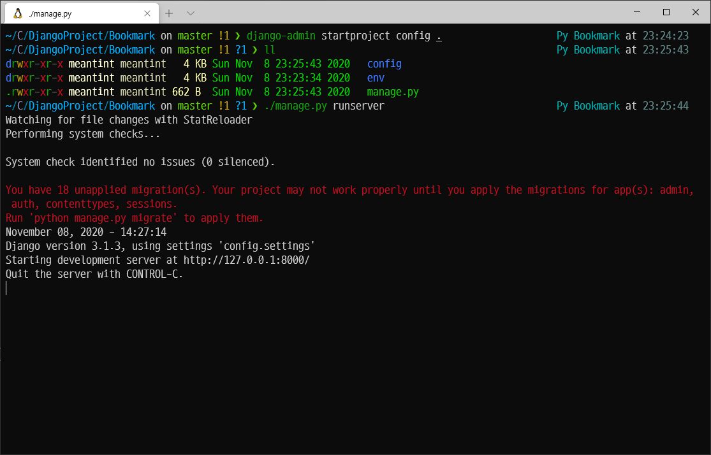</kbd></p>

- 정상적으로 작동한다.

<p align="center"><kbd>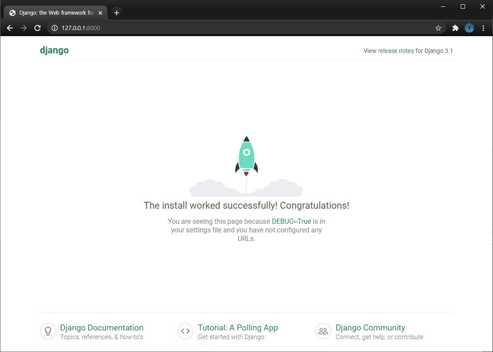</kbd></p>

- `./manage.py migrate`를 입력한다(초기에는 `unapplied migration`들을 `apply` 하기위함)

<p align="center"><kbd>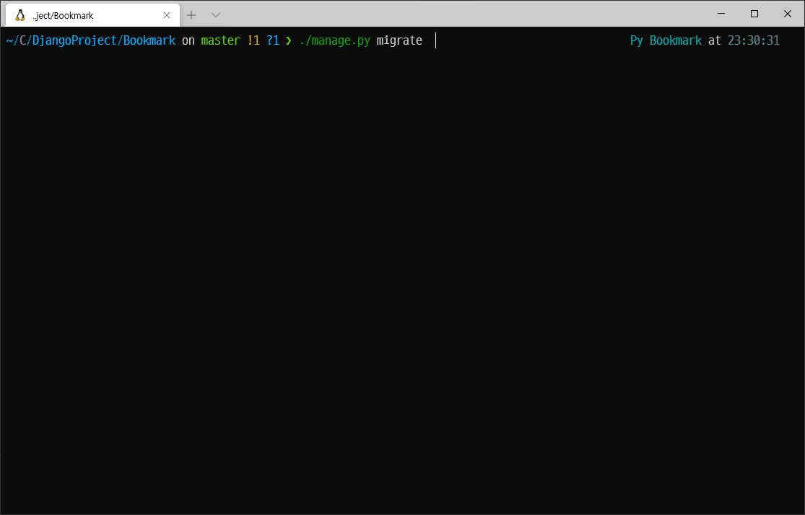</kbd></p>

<p align="center"><kbd>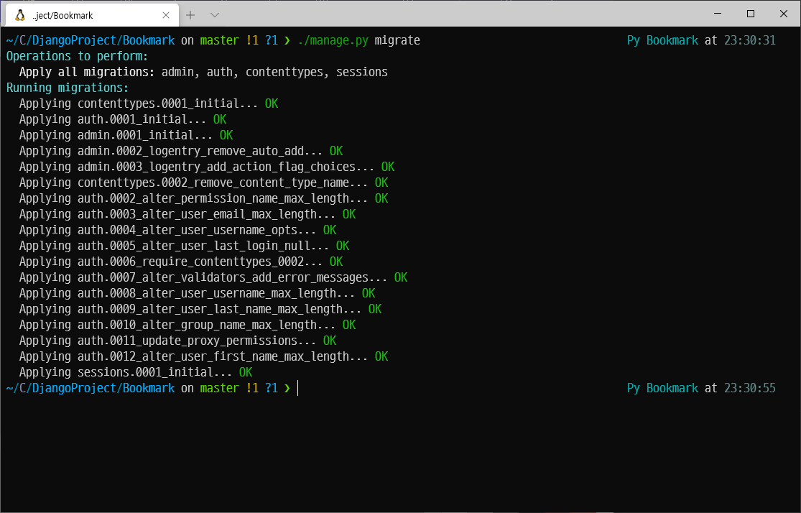</kbd></p>

- `./manage.py createsuperuser` 명령어로 `Username`, `Email Address`, `Password`를 입력해준다.

<p align="center"><kbd>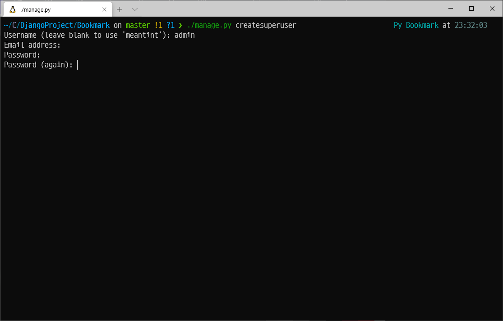</kbd></p>

- `./manage.py startapp bookmark` 명령어로 `bookmark app`을 만든다.

<p align="center"><kbd>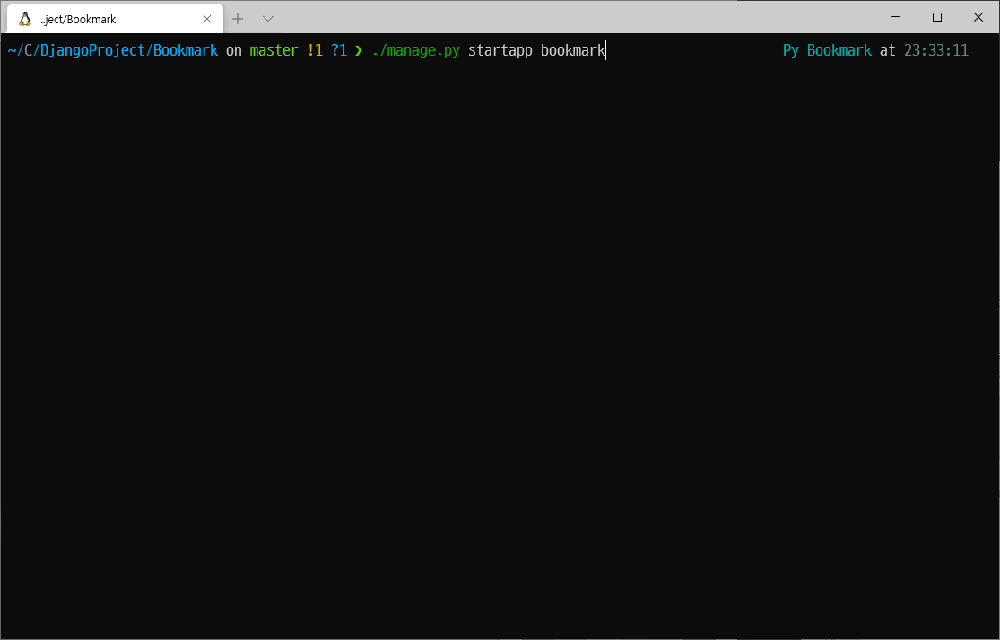</kbd></p>

- `app`을 만들었으면 `config/settings.py` 안의 `INSTALLED_APPS`에 만든 `app`의 이름을 추가해준다.

<p align="center"><kbd>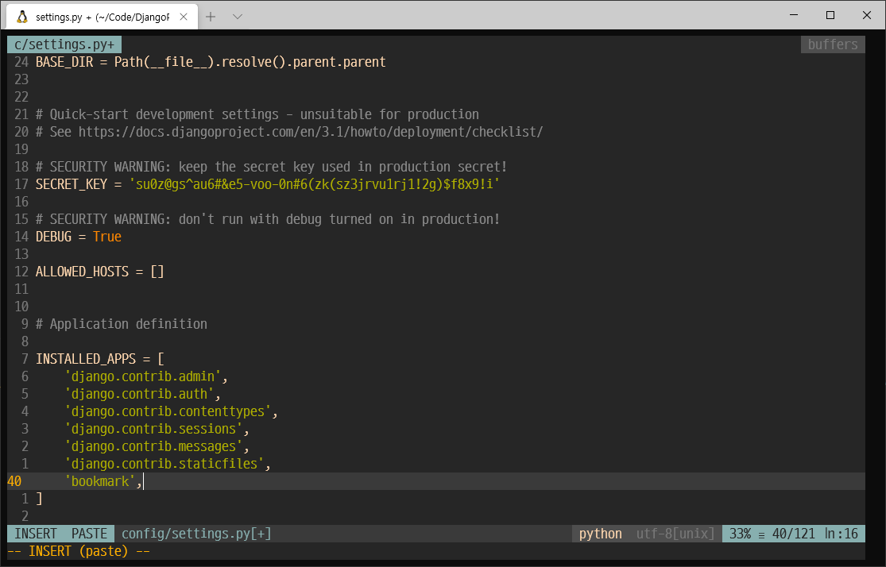</kbd></p>

- 이후 `bookmark/models.py` 안에 `Bookmark` 클래스를 만들어준다.

- `Bookmark` 클래스는 테이블이라고 볼 수 있다(데이터베이스에 저장되는 형태를 나타내기 때문에).

```python
# bookmark/models.py
from django.db import models

# Create your models here.
class Bookmark(models.Model):
    # 이 안에 들어가는 필드들이 데이터베이스에 저장 될 컬럼 값
    # 타입을 명시해줘야 함
    site_name = models.CharField(max_length=100)  # 100글자까지 저장 가능!
    url = models.URLField('')  # '이 안의 이름'으로 필드명을 보여주겠다.
```

- 내가 만든 모델이 잘 작동하는지 보기 위해 `bookmark/admin.py`를 설정해준다.

```python
# bookmark/admin.py
from django.contrib import admin

# Register your models here.
# admin.py : 내가 만든 모델을 관리자 페이지에서 관리할 수 있도록 등록
from .models import Bookmark

admin.site.register(Bookmark)
```

- `./manage.py makemygrations bookmark` 명령어를 입력해주면 `bookmark/migrations/0001_initial.py` 파일이 생성된다.

<p align="center"><kbd>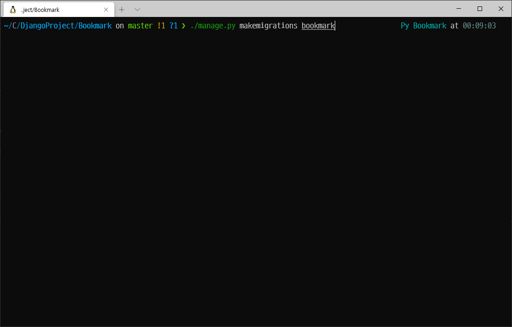</kbd></p>

- `bookmark/migrations/0001_initial.py` 파일

<p align="center"><kbd>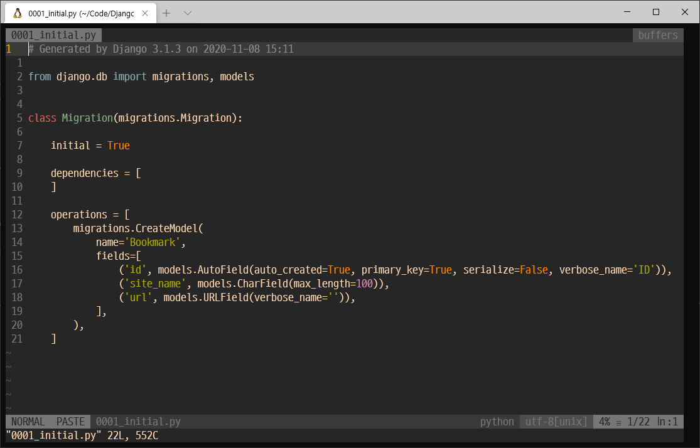</kbd></p>

- `./manage.py migrate bookmark` 명령어를 입력한 후 `./manage.py runserver` 명령어를 입력하고 `http://127.0.0.1:8000/admin`에 들어가면 다음과 같은 화면을 볼 수 있다.

<p align="center"><kbd>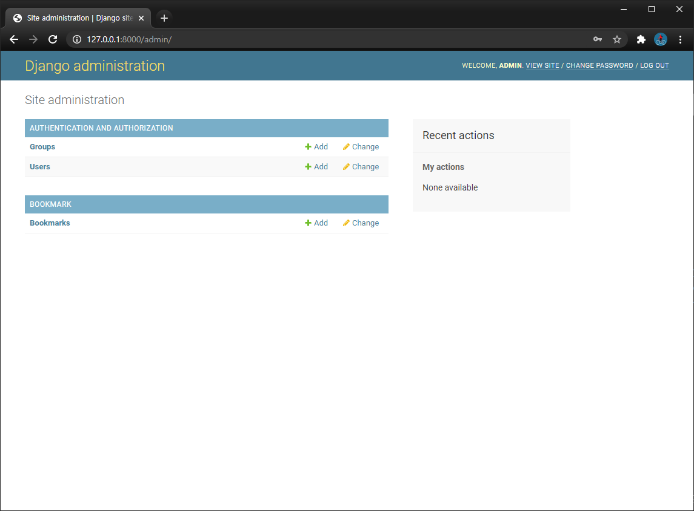</kbd></p>

- 위의 화면에서 `Add`를 눌러 정보를 작성 후 저장하면

<p align="center"><kbd>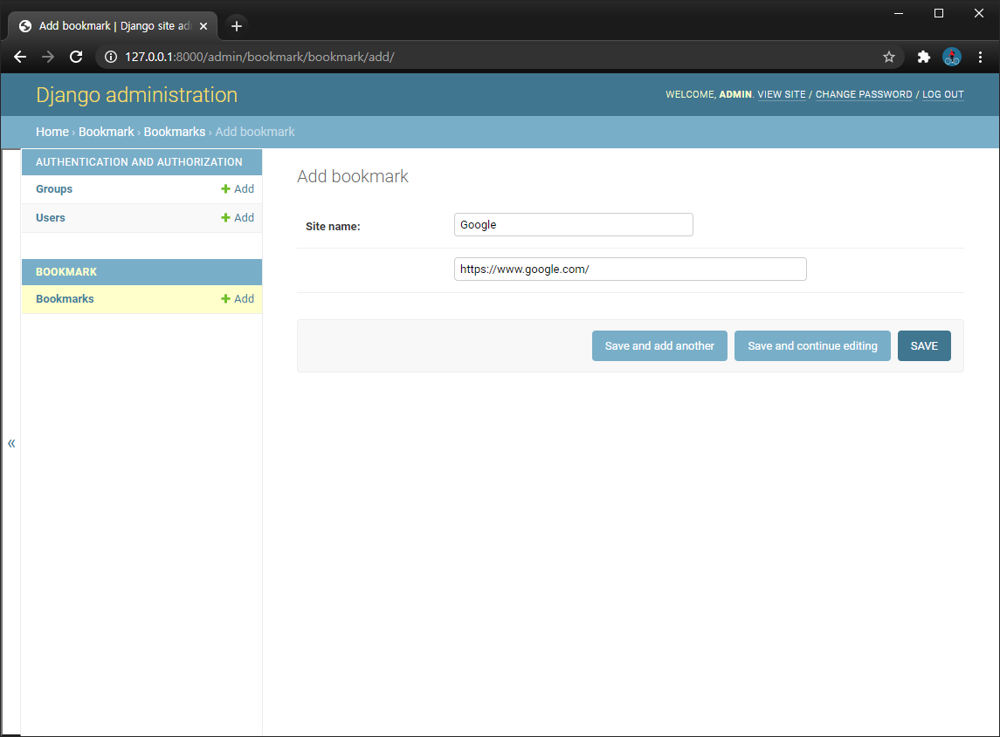</kbd></p>

- `Bookmark Object`가 추가된 것을 알 수 있다.

<p align="center"><kbd>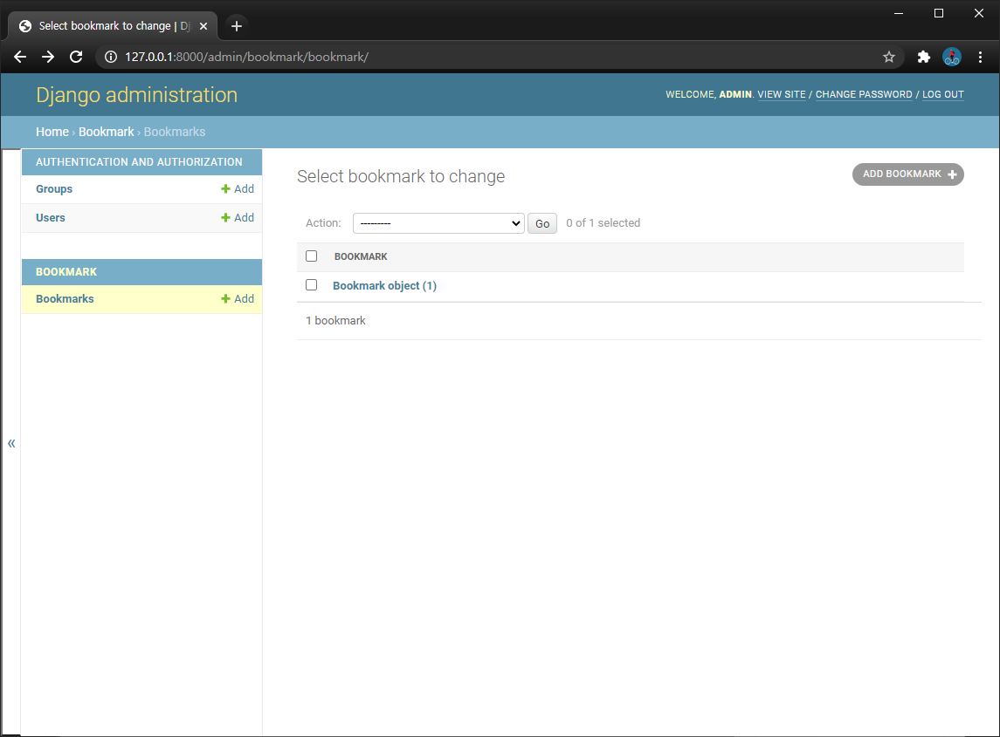</kbd></p>

### 사용한 파일 링크

- [config/settings.py](https://github.com/Meantint/Django_Study/blob/master/Bookmark/config/settings.py)

- [bookmark/models.py](https://github.com/Meantint/Django_Study/blob/master/Bookmark/bookmark/models.py)

- [bookmark/admin.py](https://github.com/Meantint/Django_Study/blob/master/Bookmark/bookmark/admin.py)

- [bookmark/migrations/0001_initial.py](https://github.com/Meantint/Django_Study/blob/master/Bookmark/bookmark/migrations/0001_initial.py)
