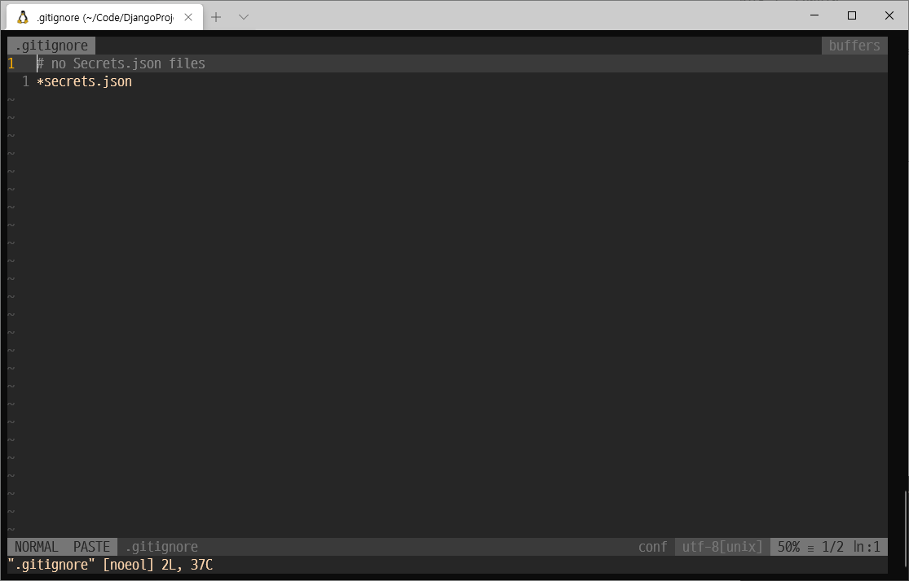

## SECRET_KEY를 위한 수정

> GitGuardian has detected the following Django Secret Key exposed within your GitHub account.

&nbsp;메일로 이런게 왔다.. 나의 `Django` `Secret Key`가 노출되고 있어서 온 것이다. 그래서 나의 `Secret Key`를 노출시키지 않고 Github 업로드를 하는 방법을 찾았다.

- `secrets.json` 파일을 만들어 다음과 같이 설정한다.

```json
{
	"SECRET_KEY": "config/settings.py의 SECRET_KEY를 여기에 복사!!"
}
```

- `.gitignore` 파일을 만들어 다음과 같이 설정한다.

- `secrets.json` 파일은 `git`에 올리지 않게 만들어준다.

<p align="center"><kbd></kbd></p>

- 이후 기존의 `config/settings.py`를 다음과 같이 바꾼다.

```python
from pathlib import Path
import os
import json  # Secret_Key를 읽어오기 위한 json 추가
from django.core.exceptions import ImproperlyConfigured  # 예외 처리를 위해 추가

# Build paths inside the project like this: BASE_DIR / 'subdir'.
BASE_DIR = Path(__file__).resolve().parent.parent

secret_file = os.path.join(BASE_DIR, 'secrets.json')  # Secrets.json을 부른다.

with open(secret_file, 'r') as f:  # open as로 secret.json을 열어준다.
    secrets = json.loads(f.read())


def get_secret(setting, secrets=secrets):  # 예외 처리를 통해 오류 발생을 검출한다.
    try:
        return secrets[setting]
    except KeyError:
        error_msg = "Set the {} environment variable".format(setting)


SECRET_KEY = get_secret("SECRET_KEY")
```