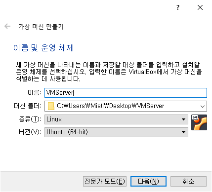
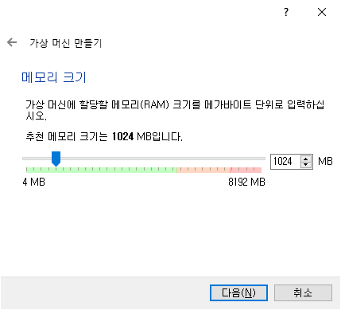
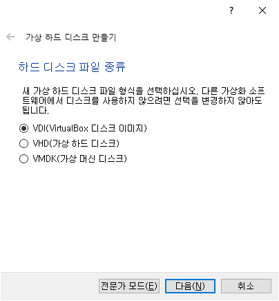
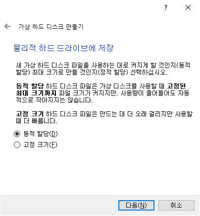
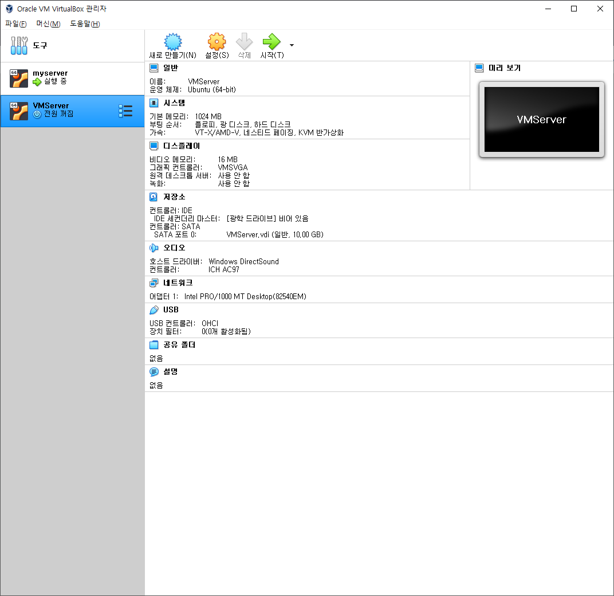
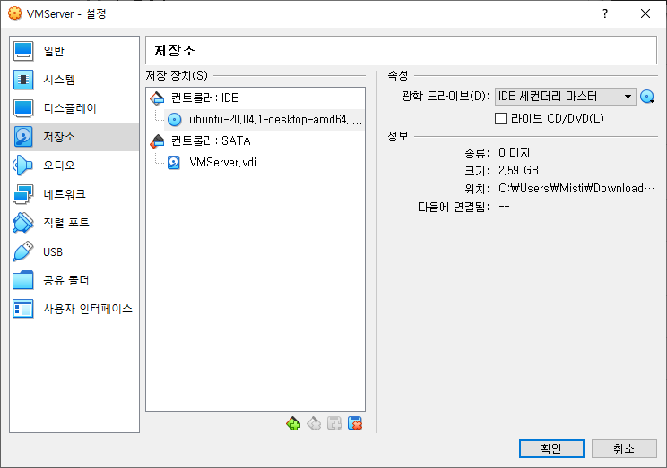

## 사용하는 이유

- 유닉스 환경에서 작업하기 위해서 `Oracle VM VirtualBox`로 `Ubuntu`를 사용하려고 한다.

## VirtualBox란

- `VirtualBox`는 오라클이 개발 중인 소프트웨어로 리눅스, macOS, 솔라리스, 윈도우를 운영체제로 가상화 하는 x86 가상화 소프트웨어이다.

## 가상 환경 만들기

1. **VirtualBox 설치**

    - [https://www.virtualbox.org/](https://www.virtualbox.org/)에서 받는다.

	- 내가 받은 버전 : `VirtualBox 6.1.16`

2. **Ubuntu iso 파일 설치**

    - 가상 머신에서 사용할 Ubuntu를 위해 iso 파일을 인터넷에서 받는다.

    - [https://ubuntu.com/download/desktop](https://ubuntu.com/download/desktop)

	- 내가 받은 버전 : `Ubuntu 20.04.1 LTS`

3. **가상 머신 만들기**

    - 새로 만들기를 누르면 다음과 같은 화면이 나타난다.

	- 종류를 `Linux`로, 버전을 `Ubuntu (64-bit)`로 설정해주었다.
    
	

	- 이후의 과정은 기본 설정대로 하였기 때문에 이미지만 넣어놓았다.

	

	

	

	

	

	- 파일 위치 및 크기까지 설정 후 만들기를 클릭하면 아래의 이미지와 같이 내가 설정한대로 `VMServer`가 만들어 진것을 볼 수 있다.

	

	- 위의 이미지에서 `VMServer`를 클릭한 후 `설정 -> 저장소`를 누르면 아래의 이미지가 나온다.

	- 아래의 이미지 오른쪽에 CD 모양을 누르면 아까 `2번`에서 받은 iso 파일이 보이는데 그것을 클릭 후 확인을 누르면 된다.

	