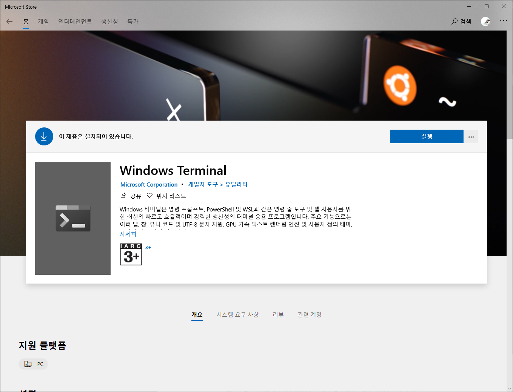
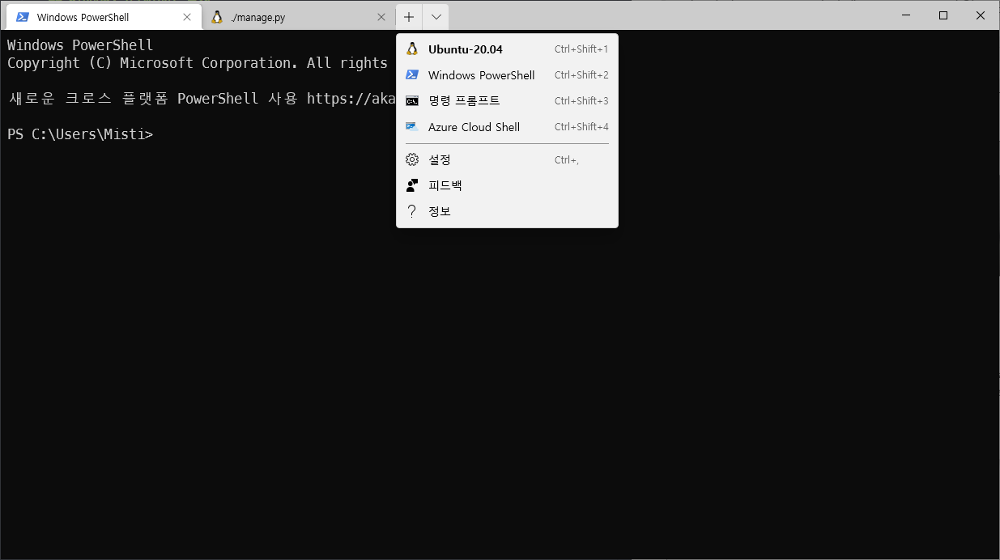
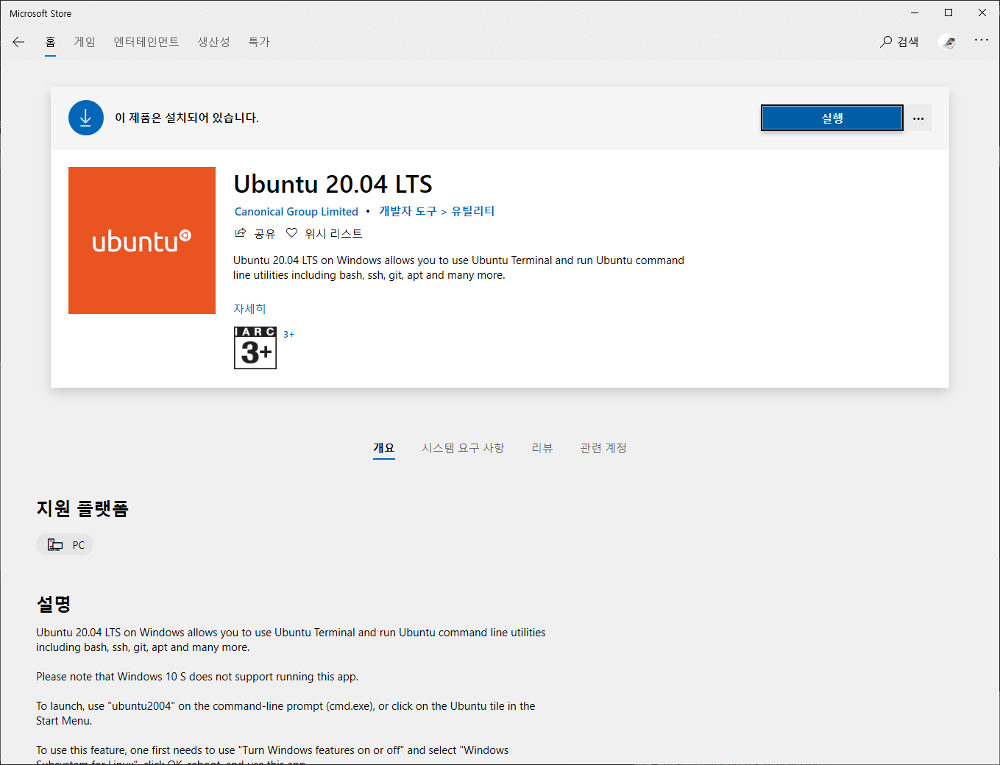
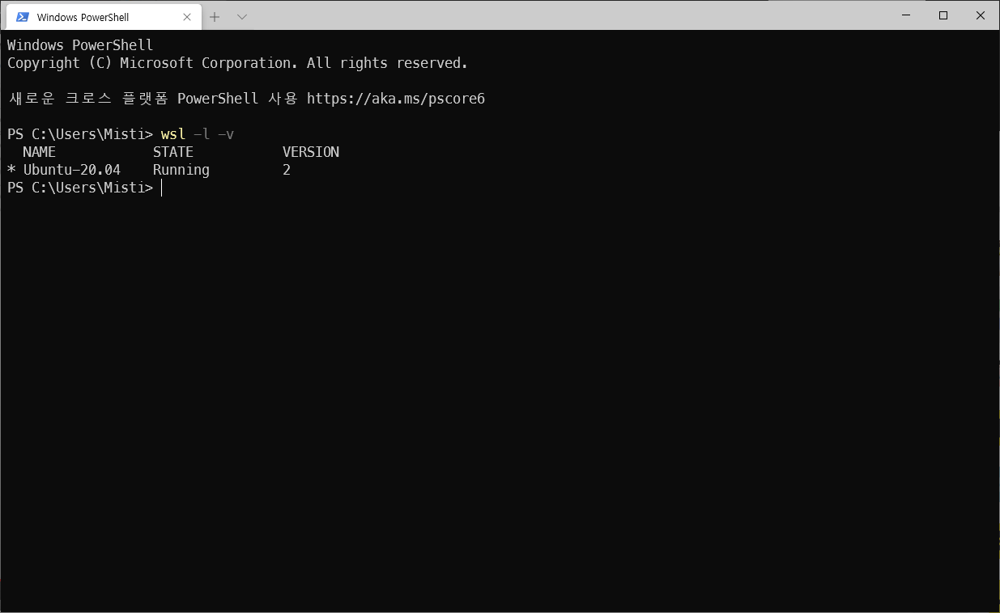
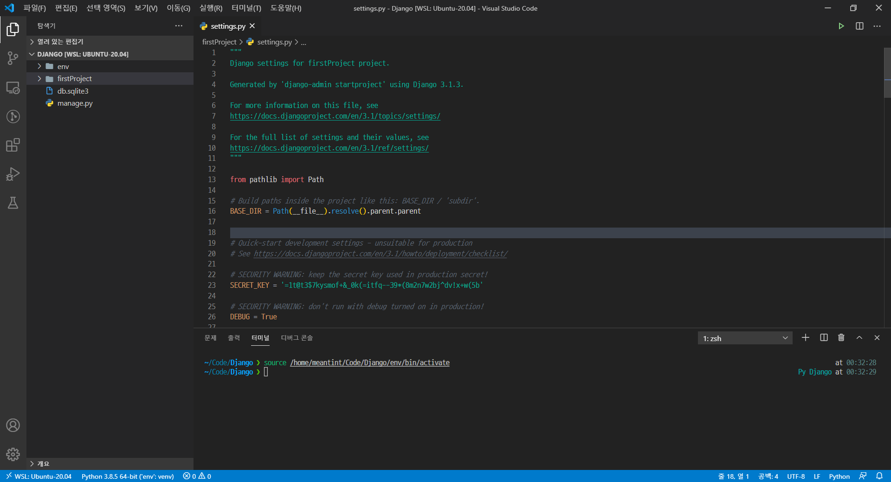

## WSL이란?

> WSL은 Windows Subsystem for Linux의 약자로 윈도우 10에서 네이티브로 리눅스 실행 파일을 실행하기 위한 호환성 계층이다.

## Windows Terminal 설치

> Windows Terminal은 마이크로소프트가 개발한 윈도우 10용 단말 에뮬레이터이다. 명령 프롬프트, 파워셀, WSL, SSH 지원을 포함한다.

> 다중 탭 창이 가능하며, 여러 개의 터미널 앱도 동시에 실행할 수 있다.

- `Microsoft Store`에 들어간 후 `windows terminal`이라고 검색하면 아래와 같이 나온다. 설치하자.

<p align="center"><kbd></kbd></p>

- 위에서 설명했던 것처럼 다중 탭 창이 가능하고 여러 터미널 앱을 실행할 수 있다.

<p align="center"><kbd></kbd></p>

## Ubuntu 20.04 LTS 설치

- `Microsoft Store`에 들어간 후 `Ubuntu`만 쳐도 연관으로 `20.04` 버전이 나온다. 설치하자.

<p align="center"><kbd></kbd></p>

## WSL2 설치

- 우선 `Linux용 Windows 하위 시스템 옵션 기능`을 사용할 수 있도록 다음의 명령어를 `PowerShell`에 입력한다.

- `PowerShell`을 관리자 권한으로 열어줘야 한다!!

```powershell
dism.exe /online /enable-feature /featurename:Microsoft-Windows-Subsystem-Linux /all /norestart
```

- 이후 `Virtual Machine 플랫폼 옵션 기능`을 사용할 수 있도록 다음의 명령어를 `PowerShell`에 입력한다.

```powershell
dism.exe /online /enable-feature /featurename:VirtualMachinePlatform /all /norestart
```

- 위에 말한 것들을 모두 설치했다면, `PowerShell`에서 `wsl -l -v` 명령어를 입력했을 때 다음과 같이 나올 것이다.

- 아래 이미지는 설치 후 이미지기 때문에 버전이 2다. 원래는 1이 나와야 정상.

<p align="center"><kbd></kbd></p>

- Linux 커널 업데이트 패키지 다운로드를 해준다.

- [https://docs.microsoft.com/ko-KR/windows/wsl/wsl2-kernel](https://docs.microsoft.com/ko-KR/windows/wsl/wsl2-kernel)

- `Ubuntu`에 들어가서 아이디, 패스워드를 설정하고 `sudo apt update`, `sudo apt upgrade` 명령어로 업데이트 및 업그레이드를 해준다. 오래 걸리니까 인터넷 서핑하고 있으면 된다.

- 마지막으로 `wsl --set-version Ubuntu-20.04 2` 명령어를 통해 WSL 버전을 2로 올려준다. 다시 한 번 `wsl -l -v`를 했을 때 버전이 2가 나온다면 정상적으로 설치된 것이다.

## WSL2를 설치하게 된 계기

&nbsp;새벽에(20.11.04) 예전부터 제대로 공부하고 싶었던 `Vim`을 설치하고 공부를 하다가, 어떤 블로그의 다른 이전 게시물에 `WSL2` 설치 방법이 있었는데 wsl이 뭐지 하고 곰곰히 생각해보다 예전에 '유튜브에서 잠시 보고 넘어 갔던 윈도우에서 리눅스를 쓸 수 있는 그거구나..!'라고 생각이 들어 그 게시물을 들어가보았다.
&nbsp;글을 보면서 굳이 `VirtualBox`로 할 이유가 있을까라는 생각이 들어(정말 생초보라 `VirtualBox`를 이용해 프로젝트 진행하는게 어려울 것 같았음) 고민하였고 하찮은 내 생각에서는 필요없다는 결론이 나와서 한 번 써보기로 했다.

## 이것저것 보다가 알게된 것

- `VSCode`와 호환이 된다. `Remote - WSL`을 설치하면 훨씬 더 수월하게 작업할 수 있을 것 같다.

<p align="center"><kbd></kbd></p>