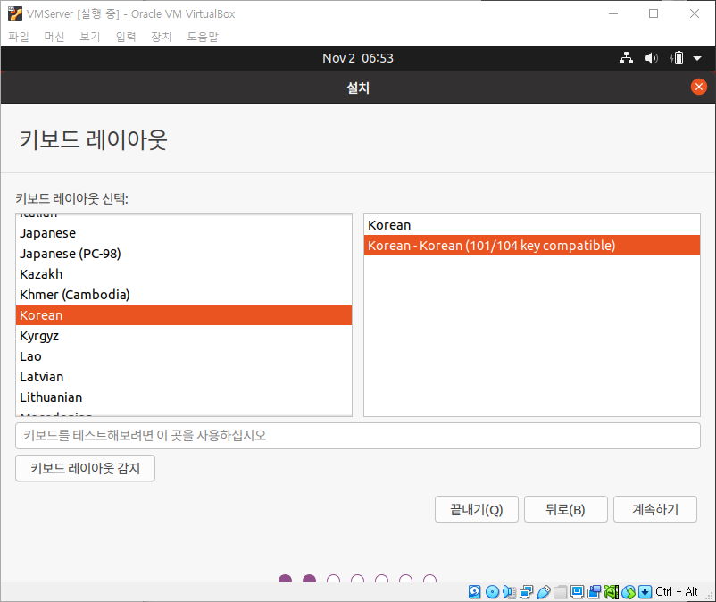
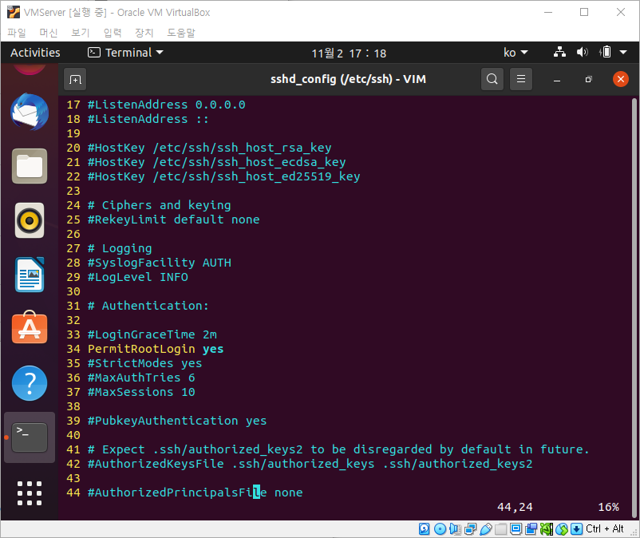

## Ubuntu 설치하기

- 키보드 레이아웃을 `Korean`으로 바꾼 것을 제외한 나머지 과정들은 기본 설정하였다.

<kbd></kbd>

<kbd></kbd>

<kbd></kbd>

<kbd></kbd>

## Ubuntu 세팅하기

- `root` 비밀번호 설정을 위해 `sudo passwd` 명령어를 사용한다.

<kbd></kbd>

- 반영구적으로 `root` 계정을 사용할 수 있도록 `sudo su` 명령어를 사용한다.

<kbd></kbd>

- `ssh` 설치를 위해 `apt-get install ssh` 명령어를 사용한다.

> ssh는 Secure SHell의 약자로 네트워크 상의 다른 컴퓨터에 로그인하거나 원격 시스템에서 명령을 실행하고 다른 시스템으로 파일을 복사할 수 있도록 해 주는 응용프로그램이다. 기본적으로 22번 포트를 사용한다.

> apt와 apt-get의 차이는 크게 없으나 apt-get의 설치 중 메뉴얼이 apt보다 많고 apt는 하단에 진행바가 표시된다.

<kbd></kbd>

- 설치 되어 있는 패키지들의 새로운 버전을 확인하기 위해 `apt-get update`를 사용하였으나, 할 필요 없었다(하고나서 깨달음).

<kbd></kbd>

- `vim` 설치를 위해 `apt-get install vim` 명령어를 사용한다.

> vim은 vi 호환 텍스트 편집기이다. vim 스크립트 등을 사용해 자유롭게 편집 환경을 변경할 수 있고, 확장된 정규 표현식 문법, 강력한 문법 강조 기능, 다중 되돌리기, 유니코드를 비롯한 다국어 지원, 문법 검사 등을 쓸 수 있다는 장점이 있다.

<kbd></kbd>
	

- `vi ~/.vimrc` 명령어를 통해 사용자 계정의 디렉토리 아래에 `.vimrc` 파일을 만들어준다.

<kbd></kbd>

- 인터넷을 참고하여 아래와 같이 설정하였다.

<kbd></kbd>

- `vi /etc/ssh/sshd_config` 명령어로 `sshd_config` 파일을 연다.

<kbd></kbd>

- `root` 로그인을 할 수 있도록 34번째 줄을 `PermitRootLogin yes`로 바꿔준다(초기 상태는 주석상태).

<kbd></kbd>

- `/etc/init.d/ssh restart` 명령어를 통해 ssh 서비스를 재시작 해준다.

> /etc/init.d/ssh restart, systemctl restart ssh, service ssh restart 모두 같은 명령어이다.

<kbd></kbd>

- `ifconfig` 명령어를 사용하기 위해 `apt install -y net-tools` 명령어로 `net-tools`를 설치해준다.

> -y는 중간에 나오는 yes or no 선택을 자동적으로 yes를 선택하게 해준다.

<kbd></kbd>

- `ifconfig` 명령어를 통해 호스트 주소를 알아낸다(초록색 밑줄)

<kbd></kbd>

- `putty`를 이용해서 원격 접속을 시도했는데 안되서 일단 `systemctl start sshd` 명령어를 통해 서비스를 시작해주었다.

<kbd></kbd>

